# BD: Practical Work APF-T

**Group**: P2G7

- Diogo Silva, MEC: 108212
- Duarte Santos, MEC: 113304

## Execution Instructions (Development)

You can change the database access credentials in the `Database` class in the project, located in the `./ui/funeraria/Entities/` folder by modifying the variables `serverAddress`, `databaseName`, `databaseUsername` and `databasePassword`.

[Database File](./ui/funeraria/Entities/Database "Database.cs")

---

## Introduction

Our database aims to support the management of funeral services, efficiently organizing processes, clients, products, ceremonies and human resources involved.

---

## Requirements Analysis

The system must allow:
- Registration and authentication of users responsible for managing processes:
    - For Registration, the following are required: Name, Email, Username, Password and an image (optional);
    - For authentication, only the Username and password are required;
- Having processes created by a user (employee) that represent a funeral service with all detailed information;
- That employees register the essential data of the applicant (client). This data must include:
    - Name, Contact, ID and Degree of kinship in relation to the deceased;
- That personal information about the deceased that must be registered:
    - Name, Gender, Date of birth, Nationality, Marital status, Residence and ID;
- Having each process associated with a funeral;
- The possibility of having a religious ceremony and for that it will be necessary:
    - Priest;
    - Church;
- Managing inventory and product orders. Within products we have the following types:
    - Flowers;
    - Urns;
    - Coffin;
- Having Florists who are flower suppliers;
- Recording the location and price associated with the final destination of the body;
- Choosing between cremation or burial:
    - In case of burial, we only need a coffin and a cemetery;
    - In case of cremation, we will need an Urn, a coffin and a crematorium;

---

## DER - Entity Relationship Diagram

### Final Version

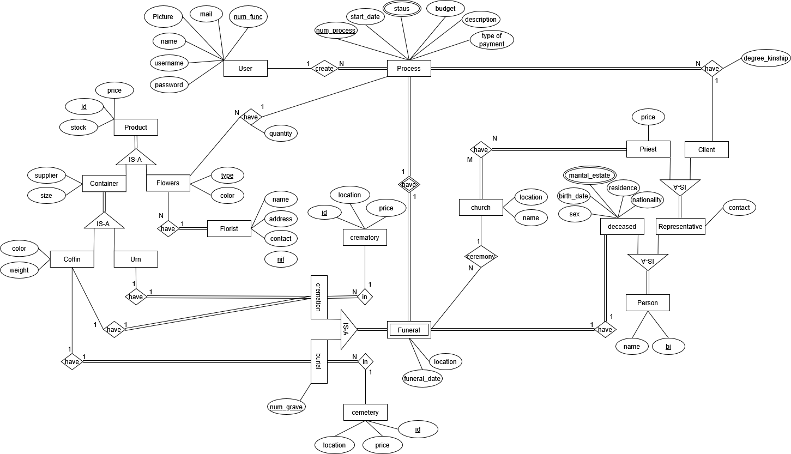

---

## ER - Relational Schema

### Final Version

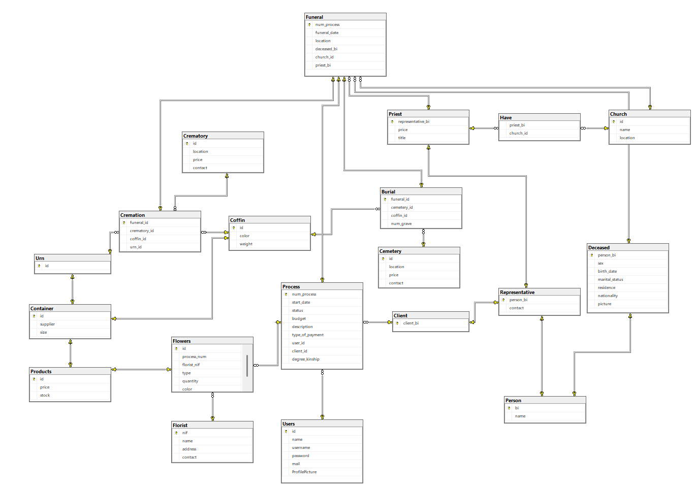

---

## ​SQL DDL - Data Definition Language

[SQL DDL File](./db/01_ddl.sql "SQLFileQuestion")

---

## SQL DML - Data Manipulation Language

### Authentication

#### Login

Initially, a login page is presented to access the application. For this we use a stored procedure `AuthenticateUser` to authenticate with the user's credentials. The SP `AuthenticateUser` returns the user's id if the credentials are correct, otherwise it sends an error message.

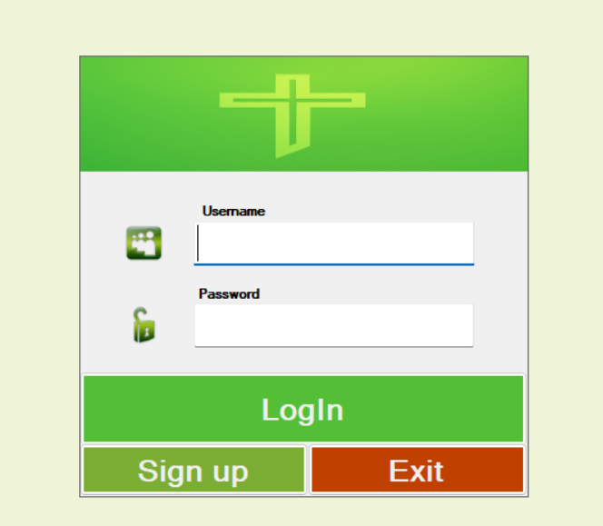


#### Register

In this field, we can register new employees in the application, requiring login after registration. For registration we use the SP `RegisterUser`. No additional queries are needed because after registration you need to login.


#### View Profile

In this section it is possible to see all information related to the employee. On this page we can also edit and delete the same.

```sql
SELECT * FROM Users WHERE id = @UserId
```
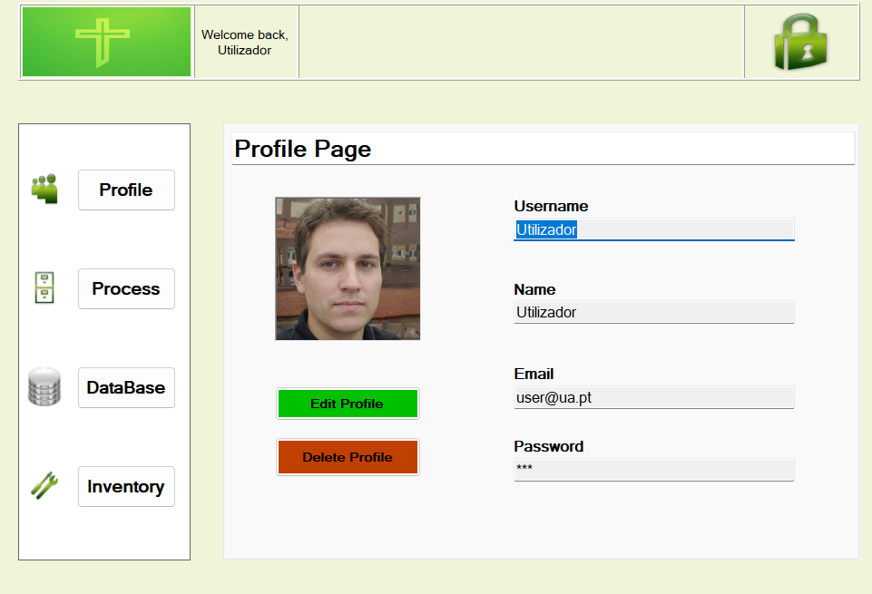

To update user information, we use the stored procedure `sp_updateUser`.

```sql
-- To delete the account we use:
DELETE FROM Users WHERE id = @UserID
```

#### Inventory Page
In this section, the funeral home's inventory is managed, namely coffins, urns and flowers. To fetch the entire inventory we do:

```sql
SELECT * FROM Products
```

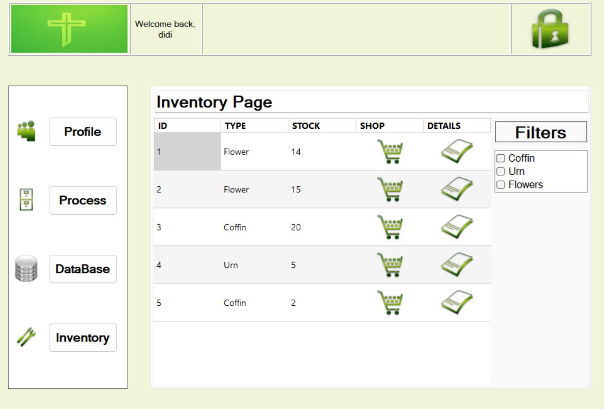

Furthermore, we can filter products by type. For this, we use a view to fetch the Type of each product, `vw_AllProducts`. In this query, it is necessary to pass the `@productID` to select its type.

```sql
SELECT Tipo FROM vw_AllProducts WHERE id = @productID
```

In the example below we are only selecting products of type `coffin`.

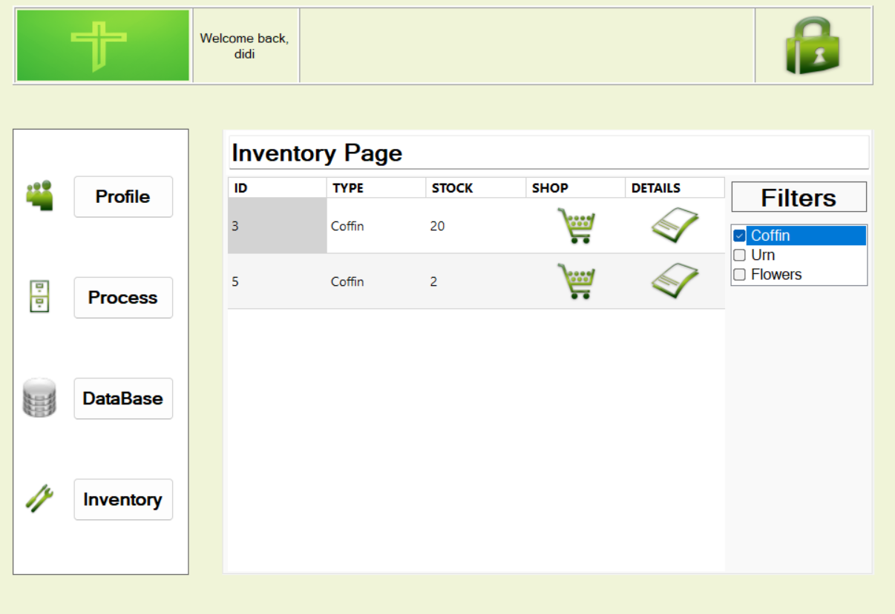

Still on the inventory page, we can buy more quantity of a product and see its details.

To update the stock of a specific product:

```sql
-- Select the product
SELECT stock FROM Products WHERE id = @productId

-- Update the stock
UPDATE Products SET stock = stock + @quantity WHERE id = @productId
```

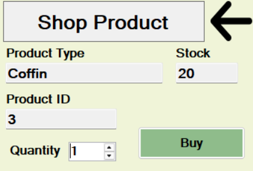


To view details of the same:

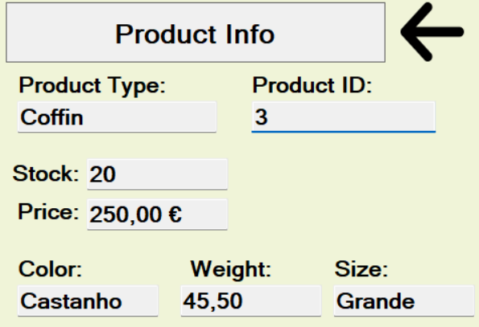


#### Database Page

The Database tab of the funeral home is where the employee manages:
- Cemeteries;
- Crematories;
- Priests;
- Churches;
- Florists;

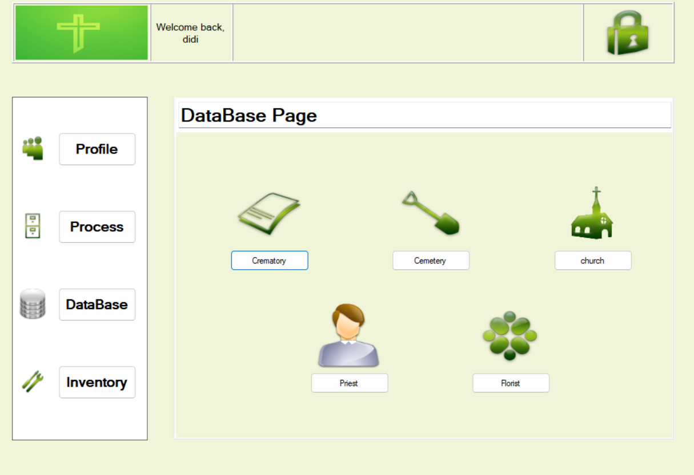

**Crematory Management**

Within the Database page, if we select the crematory tab, we go directly to the crematory management page. Here, we can create/edit/delete crematories.

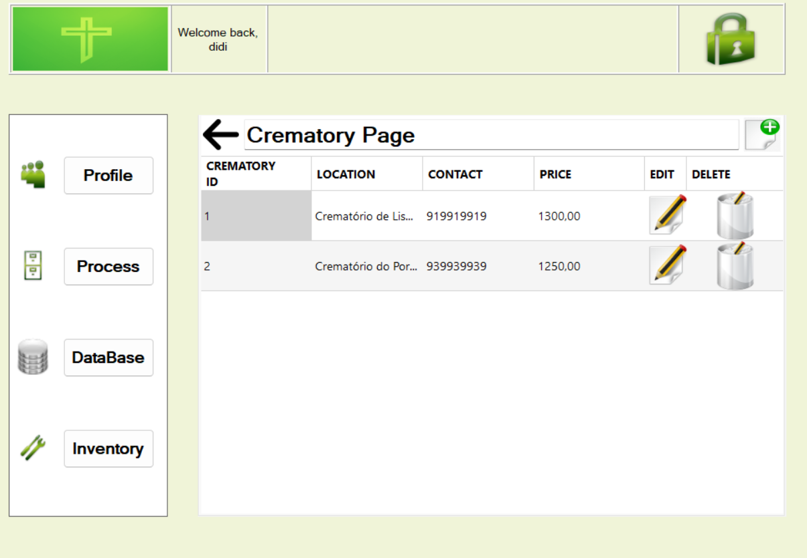

**Creating a new crematory**

To add a new crematory we have to make use of a sp `sp_addCrematory`. To do this we have to provide a `@Location`, a `@Contact` and a `@Price`.

```sql
CREATE PROCEDURE sp_addCrematory
    @Location NVARCHAR(255),
	@Contact INT,
	@Price DECIMAL(18, 2),
    @Status INT OUTPUT,
    @Message NVARCHAR(4000) OUTPUT
AS
BEGIN
    SET NOCOUNT ON;

    BEGIN TRY
        IF EXISTS (SELECT * FROM Crematory WHERE contact = @Contact)
        BEGIN
            SET @Status = 0;
            SET @Message = 'Crematory with contact already exists!';
            RETURN;
        END

        INSERT INTO dbo.Crematory(location, contact, price)
        VALUES(@Location, @Contact, @Price)

        SET @Status = 1;
        SET @Message = 'Crematory added successfully';
    END TRY
    BEGIN CATCH
        SET @Status = 0;
        SET @Message = ERROR_MESSAGE();
    END CATCH
END
GO
```

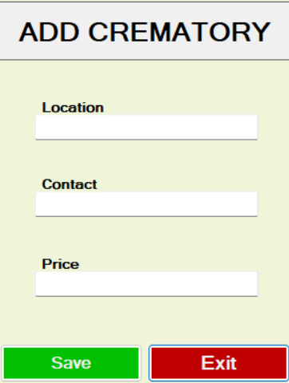

**Edit a Crematory**

As mentioned earlier, it is possible to edit a crematory, and for this we use the stored procedure `sp_updateCrematory`.


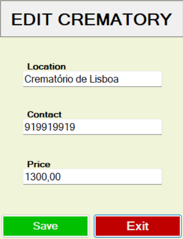


To delete a crematory, the stored procedure `sp_removeGameImage` is used.

```sql
DELETE FROM Crematory WHERE id = @CrematoryID
```


```
This logic is applied to the remaining elements of the funeral home Database page.
```

#### Process Page

This page manages all funeral processes. Essentially, this is where the employee creates a process related to a funeral and details all its information. 

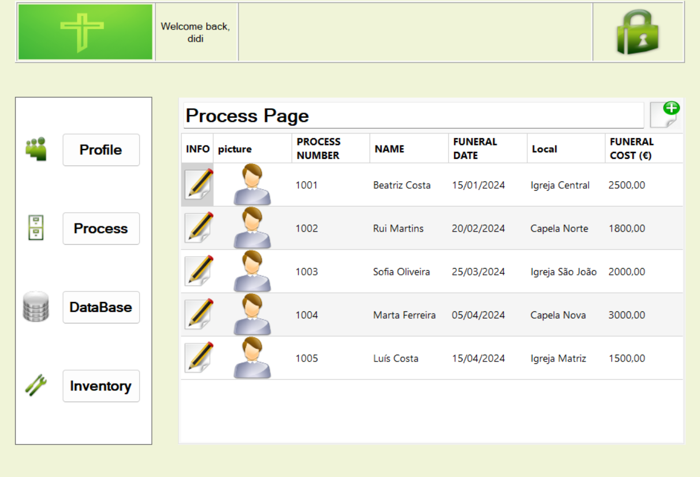


First, when we want to create a new process, we need to associate it with a number (process number). For this we use a UDF to verify the existence of a process already with that number, `findProcNumberExists`.

```sql
CREATE FUNCTION dbo.findProcNumberExists(@proc_number INT)
RETURNS BIT
AS 
BEGIN
    DECLARE @exists BIT;

    IF EXISTS (
        SELECT 1
        FROM Process pr
        WHERE pr.num_process = @proc_number
    )
        SET @exists = 1;
    ELSE
        SET @exists = 0;

    RETURN @exists;
END
GO
```

To create a process we will need the following entities:
- Deceased;
- Person;
- Representative;
- Client;
- Funeral;
- Have;
- Cremation; (depending on the type of funeral)
- Burial; (depending on the type of funeral)

This process creation process is done using the SP `sp_addProcess`. Since this step involves inserting data into several tables, we use `TRANSACTION` (in case of error to rollback). 

**Delete a process**

To delete a process we use a SP `sp_DeleteProcess` and also a trigger `trg_DeleteProcess`. The latter serves as support so that when we delete a process, it removes information about the process in question from associated tables.

```sql
CREATE TRIGGER trg_DeleteProcess
ON dbo.Process
INSTEAD OF DELETE
AS
BEGIN
    SET NOCOUNT ON;

    -- Get the process IDs that are being deleted
    DECLARE @deletedProcesses TABLE (process_id INT);
    INSERT INTO @deletedProcesses SELECT num_process FROM deleted;

    -- Delete from Flowers first (references Process directly)
    DELETE FROM dbo.Flowers
    WHERE process_num IN (SELECT process_id FROM @deletedProcesses);

    -- Delete from Cremation (relies on Funeral)
    DELETE FROM dbo.Cremation
    WHERE funeral_id IN (SELECT process_id FROM @deletedProcesses);

    -- Delete from Burial (relies on Funeral)
    DELETE FROM dbo.Burial
    WHERE funeral_id IN (SELECT process_id FROM @deletedProcesses);

    -- Delete from Funeral
    DELETE FROM dbo.Funeral
    WHERE num_process IN (SELECT process_id FROM @deletedProcesses);

    -- Finally delete from Process table
    DELETE FROM dbo.Process
    WHERE num_process IN (SELECT process_id FROM @deletedProcesses);
END;
GO
```
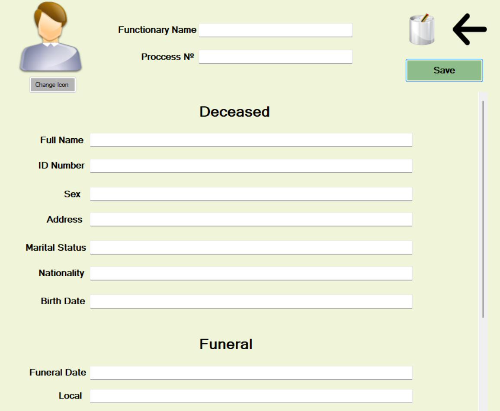


---

### Application of Cursors

In our funeral home management project, cursors are mainly used for the dynamic calculation of funeral process budgets, implemented in the stored procedure `sp_UpdateFuneralBudgets`. Here's how they work:

```sql
CREATE PROCEDURE sp_UpdateFuneralBudgets
AS
BEGIN
    DECLARE @process_id INT,
            @cemetery_price DECIMAL(10,2),
            @crematory_price DECIMAL(10,2),
            @priest_price DECIMAL(10,2),
            @container_price DECIMAL(10,2),
            @flower_price DECIMAL(10,2),
            @total_price DECIMAL(10,2),
            @funeral_type NVARCHAR(50);

    DECLARE funeral_cursor CURSOR FOR
        SELECT f.num_process,
            CASE
                WHEN EXISTS (SELECT 1 FROM Burial WHERE funeral_id = f.num_process) THEN 'Burial'
                WHEN EXISTS (SELECT 1 FROM Cremation WHERE funeral_id = f.num_process) THEN 'Cremation'
                ELSE NULL
            END AS funeral_type
            FROM Funeral f;

    OPEN funeral_cursor;
    FETCH NEXT FROM funeral_cursor INTO @process_id, @funeral_type;

    WHILE @@FETCH_STATUS = 0
    BEGIN

        -- Reset prices
        SET @cemetery_price = 0;
        SET @crematory_price = 0;
        SET @container_price = 0;
        SET @flower_price = 0;
        SET @priest_price = 0;

        -- Handle Burial
        IF @funeral_type = 'Burial'
        BEGIN
            SELECT @cemetery_price = c.price
            FROM Cemetery c
            JOIN Burial b ON b.cemetery_id = c.id
            WHERE b.funeral_id = @process_id;

            SELECT @container_price = p.price
            FROM Burial b
            JOIN Coffin cf ON cf.id = b.coffin_id
            JOIN Products p ON p.id = cf.id
            WHERE b.funeral_id = @process_id;
        END

        -- Handle Cremation
        IF @funeral_type = 'Cremation'
        BEGIN
            SELECT @crematory_price = c.price
            FROM Crematory c
            JOIN Cremation b ON b.crematory_id = c.id
            WHERE b.funeral_id = @process_id;

            DECLARE @cremation_coffin_price DECIMAL(10,2) = 0;
            DECLARE @urn_price DECIMAL(10,2) = 0;

            SELECT @cremation_coffin_price = p.price
            FROM Cremation c
            JOIN Coffin cf ON cf.id = c.coffin_id
            JOIN Products p ON p.id = cf.id
            WHERE c.funeral_id = @process_id;

            SELECT @urn_price = p.price
            FROM Cremation c
            JOIN Urn u ON u.id = c.urn_id
            JOIN Products p ON p.id = u.id
            WHERE c.funeral_id = @process_id;

            SET @container_price = ISNULL(@cremation_coffin_price, 0) + ISNULL(@urn_price, 0);
        END

        -- Flower price: Products linked to the Flowers table
        SELECT @flower_price = SUM(p.price * f.quantity)
        FROM Flowers f
        JOIN Products p ON p.id = f.id
        WHERE f.process_num = @process_id;

        -- Priest price
        SELECT @priest_price = p.price
        FROM Funeral f
        JOIN Priest p ON p.representative_bi = f.priest_bi
        WHERE f.num_process = @process_id;


        -- Total sum
        SET @total_price = ISNULL(@cemetery_price, 0) +
                           ISNULL(@crematory_price, 0) +
                           ISNULL(@container_price, 0) +
                           ISNULL(@flower_price, 0) +
                           ISNULL(@priest_price, 0);

        PRINT 'PROCESS ID: ' + CAST(@process_id AS VARCHAR);
        PRINT 'Cemetery Price: ' + CAST(ISNULL(@cemetery_price, 0) AS VARCHAR);
        PRINT 'Crematory Price: ' + CAST(ISNULL(@crematory_price, 0) AS VARCHAR);
        PRINT 'Container Price: ' + CAST(ISNULL(@container_price, 0) AS VARCHAR);
        PRINT 'Flower Price: ' + CAST(ISNULL(@flower_price, 0) AS VARCHAR);
        PRINT 'Priest Price: ' + CAST(ISNULL(@priest_price, 0) AS VARCHAR);
        PRINT 'TOTAL: ' + CAST(@total_price AS VARCHAR);
        PRINT '------------------------------------';

        UPDATE Process
        SET budget = @total_price
        WHERE num_process = @process_id;

        FETCH NEXT FROM funeral_cursor INTO @process_id, @funeral_type;
    END;

    CLOSE funeral_cursor;
    DEALLOCATE funeral_cursor;
END;
GO
```

This cursor goes through all records in the Funeral table, determining whether each process is a burial or cremation

#### Budget Calculation Functionality
- For each funeral record, the cursor:

1. Resets price variables at the beginning of each iteration
2. Applies different calculations depending on the funeral type:
    - For Burial: Gets the cemetery and coffin price
    - For Cremation: Gets the crematory, coffin and urn price
3. Calculates additional costs that are common to all funerals:
    - Flower price
    - Priest fees
4. Sums all components to arrive at the total budget
5. Updates the Process table with the calculated value

#### Integration with the Application
The cursor is invoked through the `UpdateProcessBudget()` method in the `Database.cs` class, which calls the stored procedure:

```csharp
public void UpdateProcessBudget() {
    using (SqlCommand cmd = new SqlCommand("sp_UpdateFuneralBudgets", conn)) {
        cmd.CommandType = CommandType.StoredProcedure;
        cmd.ExecuteNonQuery();
    }
}
```
Advantages:
1. **Custom Calculation**: Allows calculating specific budgets for each funeral based on its unique components
2. **Type Differentiation**: Properly manages the different price requirements for burials and cremations
3. **Logic Centralization**: Keeps all budget calculation logic in a single stored procedure
4. **Facilitated Diagnostics**: Includes PRINT statements for debugging that help verify calculations


The implementation is supported by specific indexes that improve the performance of cursor operations, minimizing the impact on the overall system performance.


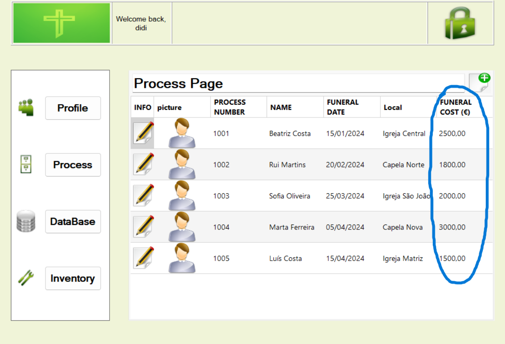

---
### Application of Indexes

#### Implementation
Regarding indexes, we implemented several types to optimize database performance. These indexes are organized into specific categories in the `07_Indexes.sql` file

1. Indexes to speed up JOINS and WHEREs
```sql
CREATE INDEX idx_funeral_num_process ON Funeral(num_process);
CREATE INDEX idx_process_num_process ON Process(num_process);
CREATE INDEX idx_funeral_church_id ON Funeral(church_id);
CREATE INDEX idx_funeral_deceased_bi ON Funeral(deceased_bi);
CREATE INDEX idx_burial_funeral_id ON Burial(funeral_id);
CREATE INDEX idx_cremation_funeral_id ON Cremation(funeral_id);
CREATE INDEX idx_flowers_process_num ON Flowers(process_num);
```
They are fundamental for speeding up the execution of the funeral cursor in the stored procedure `sp_UpdateFuneralBudgets`, as they optimize the joins between tables related to funerals.


2. Indexes for frequently accessed columns
```sql
CREATE INDEX idx_users_username ON Users(username);
CREATE INDEX idx_users_email ON Users(mail);
CREATE INDEX idx_users_id ON Users(id);
CREATE INDEX idx_person_bi ON Person(bi);
```
These indexes improve the performance of authentication and user search operations, which are frequently consulted in the stored procedures `AuthenticateUser` and `RegisterUser`.


3. Indexes for analysis and reports

```sql
CREATE INDEX idx_process_start_date ON Process(start_date);
CREATE INDEX idx_products_stock ON Products(stock);
CREATE INDEX idx_process_type_of_payment ON Process(type_of_payment);
CREATE INDEX idx_funeral_funeral_date ON Funeral(funeral_date);
```
These indexes facilitate the generation of reports and temporal analysis on processes, payments and stock management.

4. Composite indexes for specific queries
```sql
CREATE INDEX idx_person_bi_name ON Person(bi, name);
CREATE INDEX idx_funeral_church__deceased ON Funeral(church_id, deceased_bi);
CREATE INDEX idx_produts_price_stock ON Products(price, stock);
```
Composite indexes are particularly useful for complex views like `vw_LoadProcess` and `vw_AllProducts`, which use multiple join conditions.


5. Unique indexes for data integrity
```sql
CREATE UNIQUE INDEX idx_users_unique_username ON Users(username);
CREATE UNIQUE INDEX idx_users_unique_email ON Users(mail);
```
These indexes ensure the uniqueness of usernames and emails, reinforcing the integrity of the system's fundamental data.

---

## Normalization

To minimize data duplication and optimize space usage, we applied normalization up to 3NF. With this we ensure that each table has a primary key, ensuring that each record is unique. We used foreign keys to reference other tables without the need to duplicate information. The data was distributed across several tables to avoid repetition and ensure data integrity.


#### First Normal Form (1NF)

**Criteria:** All attributes in tables are atomic. There are no lists, arrays or compound fields.

- All tables use **atomic attributes**, without lists or compound structures.
- Example: `Flowers`, `Coffin`, `Urn` are separate entities, not grouped in compound fields within `Products`.

**Conclusion**: All tables are in 1NF.


#### Second Normal Form (2NF)

**Criteria:** Tables do not show partial dependencies. For example, Process has client_id, and the client data is in another table (Client, Representative, Person), which avoids partial dependency of attributes.

- Tables with composite keys like `Have(priest_bi, church_id)` were analyzed.
- All attributes depend on the key **completely**.
- Tables like `Client`, `Representative`, `Deceased` have **simple keys**, therefore **partial dependencies do not apply**.

**Conclusion**: All tables are in 2NF.

#### Third Normal Form (3NF)

**Criteria:** There are no obvious transitive dependencies. Ex.: the deceased person's data is in Deceased and their personal data is in Person, avoiding redundancy and facilitating updates.

- The attributes `name`, `contact`, `title` are well separated between `Person`, `Representative` and `Priest`.
- In `Process`, `client_id` is a FK to `Client`, and the client details are outside the table (no transitive dependency).
- The model avoids repetition of attributes like `price`, `location`, which belong to specialized tables like `Cemetery` and `Crematory`.

**Conclusion**: The structure is free of transitive dependencies and complies with 3NF.


#### Final conclusions

The database is **completely normalized up to 3NF**. Any violation of integrity or presence of redundant data was avoided.

---

## Database Initial Data

The files must be executed in the order they are numbered so that there are no errors due to dependencies.

[01_ddl.sql](db/01_ddl.sql "DDL File")

[07_db_init.sql](sql/02_db_init.sql "DB init")

[02_views.sql](db/03_views.sql "Views File")

[03_sp.sql](sql/04_sp.sql "Stored Procedures File")

[04_udf.sql](sql/05_udf.sql "UDFs File")

[05_triggers.sql](sql/06_triggers.sql "Triggers File")

[06_indexes.sql](sql/07_indexes.sql "Indexes File")

---